# Town Map Editing - HGSS
The Town Map in Heart Gold is located solely within the Poké Gear, a departure from some previous games where the Town Map is a key item that gets a very large area to mess around on.  Because of this, the region is actually relatively cramped to start out with--Kanto makes a few sacrifices to nicely fit into the 32x32 blocks that the game uses--every square that the town map has corresponds to a 32x32 grid block, hence the reason that glitches like tweaking work in Platinum to go out of bounds and access the islands for Shaymin, Darkrai, and Cresselia.

In this tutorial, I look to turn Johto & a little of Kanto into Hoenn.  While the images are included here as examples of what you can do, I ask that you refrain from copying my images (at least while I am still an active hacker, actively developing for my own hack).  Otherwise, just let me know if you want to use resources and we can talk.

## Prerequisites
- Comfortability with hex editing (and I mean comfortability, this gets pretty intense) and interpreting data
- Comfortability with Tinke

## Part 1 - Graphics
First thing's first, the graphics are the easy part.  ``a144`` contains all of the graphics for the Town Map.  These are all easily editable using Tinke--a tutorial for which will not be covered here.  Refer to Jay's tutorials on YouTube for a basics of graphics editing tutorial.

### Protagonist Portraits
Clicking on the NCLR file 0 and then the NCGR file 1 will give you the town map portraits and the selectors--set the width to 16 and the height to 232.  Here you can replace the protagonist mugshots with whatever you can fit in the 16x16 space that uses very few colors to keep the rest of the indicators the same.  The roamers are also here, all of the Beasts and the Lati twins--feel free to change those as your hack requires!


When saving, make sure to click replace palette or whatever the checkbox is.  The graphic I will use is this one:


You can even check out the portraits in the game if you repack the narc and resave the ROM:

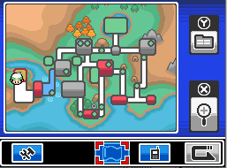

### Town Previews
Clicking on the NCLR file 14, the NCGR file 12, and the NSCR file 13 (in that order to load resources properly for editing) will give the Town Previews.  These are the things shown along the top of the Poké Gear when the town is hovered over.  There are 20 of these slots available--as this serves the purposes for my hack, I haven't looked into expanding it, but may eventually.  Kanto and Johto combined give a lot of leeway in this sense.

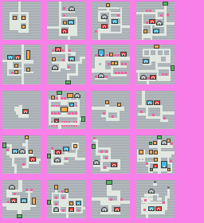

I've also been pretty careful about replacing old city maps with cities in my hack to ensure that every facet of this tutorial goes over well.  It requires a bit of planning, but will keep things nice and easy for you if you choose to edit the town map.  Editing that image and replacing the NSCR file with tiling encoding enabled will conclude the Town Previews.

I haven't personally done this for my hack yet, as I have yet to place the buildings in most cities, so I have yet to replace these graphics.  I may come back eventually and update this.

### Town Map Graphics
First we have to disable a few things from the town map code that copy over blank map parts before Kanto is unlocked.  We also make the entire region into Johto so that there are no issues dealing with the town map name changing:
```
Limit the PokéGear selectable area - Overlay 101
0x307C - [max x coord selectable]
0xFC18 - [max x coord selectable] 00 [max x coord selectable] 00 [max x coord selectable] 00
For example, my FC18 looks like 1D 00 1D 00 1D 00

Make no map replacement from right part of image before Kanto is unlocked - Overlay 101
0x3846 - 00 00 00 00 00 00
0x38D6 - 00 00
0x38E2 - 00 00

Cianwood we just replace the areas as needed.  Not all that bad, no need to find the code for it.
```
Next we have to add in the Town Map blurbs that appear when you hover over the town in the PokéGear.  This is all done in a027 file 273, so you can either replace existing entries or add new ones entirely--it's all up to you.  Just keep track of which is which.

Furthermore, change the first two entries (``Kanto`` and ``Johto``) to both be the name of your region.  Here, I replace both of mine with ``Hoenn``.

Here is the part where things get a little bit complicated.

Each selectable tile in the PokéGear corresponds to one map chunk in the overworld.  Each 32x32 overworld space is one selectable tile in the PokéGear--and you can verify this by forcing the ability to open the start menu in the Mystery Zone, even as you run around out there it still updates your position in the PokéGear.
This somewhat constrains what you can and can't do mapping-wise.  I know I have made a number of concessions when it comes to mapping my overworld (especially given that Hoenn seems to be broken into 20x20 chunks and the town map there doesn't care).

Clicking on NCLR file 23, NCGR file 10, and NSCR 11 will net this massive image.


This is a lot to take in at first.  We have the actual town map on top of the many little highlight sections at the bottom.  Here, we whip out a new town map for our new region in the top section:


*Make sure that the top leftmost tile is just the transparent (first) color in the palette!*  Issues come up if you do not abide by this, and you'll think that everything is buggy until you realize that you just didn't do this.  This is just because of how Tinke does the tiling in the NSCR file.

As we can see as well, we need to take into account that the Safari Zone areas are blocked out first, so I make sure to replace those down in the bottom right as well.  Saving this image and reopening it in the ROM:

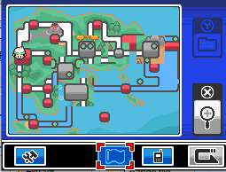

*This being a garbled mess is 100% expected!*  We still have to deal with tables.

Trust the process here, it will look better, but it isn't then worth it to stress about how it appears in game until we get through the final hex editing step.  The game does lots of tile swapping at run time.

From here, we add the gray areas to the overall image as well:

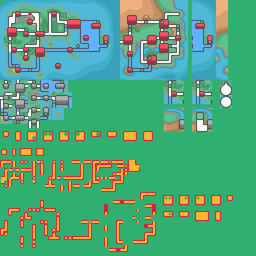

Then we just need to add the highlighted orange areas to the image, or rather the ones that are missing (including the routes):

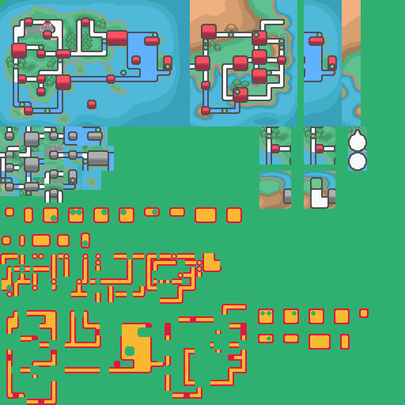

Now we move to making this look alright in the game and into overlay 101.

## Part 2 - Overlay 101 - Red/Gray City Map Chunk, Flight Spots
Overlay 101 has a table governing replacing the red town chunks with the gray town chunks when the town hasn't been visited, and another governing the orange selected overlay that appears when you select a town chunk or route chunk.  The first table is at 0x10274 (0x021F79B4) of overlay 101, the amount of entries is the byte at 0x3124 (0x021EA864 - originally 0x1B), and has the format for each entry:
```c
struct GearMapTownOverlay
{
    /* 0x0 */ u16 mapHeader;
    /* 0x2 */ u16 gateAppearance; // not sure
    /* 0x4 */ u8 entry; // maybe
    /* 0x5 */ u8 entry2; // maybe
    /* 0x6 */ u8 redX;
    /* 0x7 */ u8 redY;
    /* 0x8 */ u8 grayX;
    /* 0x9 */ u8 grayY;
    /* 0xA */ u8 townDimY:4; // msn
              u8 townDimX:4; // lsn
    /* 0xB */ u8 replacementDimY:4; // msn
              u8 replacementDimX:4; // lsn
    /* 0xC */ u8 offsetY:4; // msn
              u8 offsetX:4; // lsn
    /* 0xD */ u8 padding;
}; // entry size = 0xE
```
So let's look at this table, split up by entry (0xE in size):
```
31 00 31 00 00 00 20 0B 00 14 11 33 11 00 
32 00 32 00 01 01 1F 07 05 14 22 44 11 00 
33 00 33 00 02 02 20 02 0A 14 22 44 11 00 
34 00 34 00 03 03 28 03 0F 14 22 44 11 00 
35 00 35 00 04 04 2C 07 14 14 11 33 11 00 
36 00 36 00 05 05 28 09 19 14 22 44 11 00 
37 00 37 00 06 06 25 07 1E 14 22 44 11 00 
38 00 38 00 07 07 25 0C 23 14 22 44 11 00 
39 00 39 00 08 08 20 0F 00 18 11 33 11 00 
3A 00 3A 00 09 FF 1C 06 00 00 11 00 00 00 
3B 00 3B 00 0A 09 28 06 05 18 22 44 11 00 
3C 00 3C 00 0B 0A 15 0C 0B 19 11 11 00 00 
43 00 43 00 0C 0B 10 0C 0F 18 12 34 11 00 
49 00 49 00 0D 0C 0E 07 14 18 22 43 10 00 
4A 00 4A 00 0E 0D 0C 0E 19 18 12 34 11 00 
4B 00 4B 00 0F 0E 05 0A 1E 18 21 43 11 00 
4C 00 4C 00 10 0F 09 0A 23 18 23 45 11 00 
4D 00 4D 00 11 10 08 07 00 1C 22 44 11 00 
4E 00 4E 00 12 11 0B 04 05 1C 22 44 11 00 
57 00 57 00 13 12 10 05 0A 1C 11 33 11 00 
59 00 59 00 15 13 14 04 0F 1C 22 44 11 00 
58 00 58 00 14 FF 0F 01 00 00 23 00 00 00 
5A 00 5A 00 16 FF 19 08 00 00 11 00 00 00 
AE 00 AE 00 1E FF 02 08 00 00 22 00 00 00 
10 01 9B 01 1B FF 06 06 00 00 22 00 00 00 
60 00 18 01 23 FF 0A 06 00 00 22 00 00 00 
7C 00 1E 00 21 FF 1C 07 00 00 21 00 00 00  
```
We can see that there are clearly patterns.

Further breaking it down and labeling the names based on the map headers:
```
        mapHeader  gateHeader  entry1  entry2  redX  redY  grayX  grayY  townDim  replDim  offsetPos  padding
[0x00]  31 00      31 00       00      00      20    0B    00     14     11       33       11         00       // pallet town
[0x01]  32 00      32 00       01      01      1F    07    05     14     22       44       11         00       // viridian town
[0x02]  33 00      33 00       02      02      20    02    0A     14     22       44       11         00       // pewter
[0x03]  34 00      34 00       03      03      28    03    0F     14     22       44       11         00       // cerulean
[0x04]  35 00      35 00       04      04      2C    07    14     14     11       33       11         00       // lavender
[0x05]  36 00      36 00       05      05      28    09    19     14     22       44       11         00       // vermilion
[0x06]  37 00      37 00       06      06      25    07    1E     14     22       44       11         00       // celadon
[0x07]  38 00      38 00       07      07      25    0C    23     14     22       44       11         00       // fuchsia
[0x08]  39 00      39 00       08      08      20    0F    00     18     11       33       11         00       // cinnabar
[0x09]  3A 00      3A 00       09      FF      1C    06    00     00     11       00       00         00       // indigo plateau
[0x0A]  3B 00      3B 00       0A      09      28    06    05     18     22       44       11         00       // saffron
[0x0B]  3C 00      3C 00       0B      0A      15    0C    0B     19     11       11       00         00       // new bark town
[0x0C]  43 00      43 00       0C      0B      10    0C    0F     18     12       34       11         00       // cherrygrove
[0x0D]  49 00      49 00       0D      0C      0E    07    14     18     22       43       10         00       // violet
[0x0E]  4A 00      4A 00       0E      0D      0C    0E    19     18     12       34       11         00       // azalea
[0x0F]  4B 00      4B 00       0F      0E      05    0A    1E     18     21       43       11         00       // cianwood
[0x10]  4C 00      4C 00       10      0F      09    0A    23     18     23       45       11         00       // goldenrod
[0x11]  4D 00      4D 00       11      10      08    07    00     1C     22       44       11         00       // olivine
[0x12]  4E 00      4E 00       12      11      0B    04    05     1C     22       44       11         00       // ecruteak
[0x13]  57 00      57 00       13      12      10    05    0A     1C     11       33       11         00       // mahogany
[0x14]  59 00      59 00       15      13      14    04    0F     1C     22       44       11         00       // blackthorn
[0x15]  58 00      58 00       14      FF      0F    01    00     00     23       00       00         00       // lake of rage
[0x16]  5A 00      5A 00       16      FF      19    08    00     00     11       00       00         00       // mt silver
[0x17]  AE 00      AE 00       1E      FF      02    08    00     00     22       00       00         00       // safari zone gate
[0x18]  10 01      9B 01       1B      FF      06    06    00     00     22       00       00         00       // battle frontier / gate is access
[0x19]  60 00      18 01       23      FF      0A    06    00     00     22       00       00         00       // national park / gate is pokeathlon dome
[0x1A]  7C 00      1E 00       21      FF      1C    07    00     00     21       00       00         00       // victory road / gate is route 26
```
Every city gets an ``entry2`` field filled out.  All the entries get an ``entry1`` field.  I do not know much about these--I just use the existing ones in an effort not to renovate anything that doesn't need renovated.  

How do we interpret the ``redX``, ``redY``, ``grayX``, and ``grayY`` fields? 

Tiles form tilesets (NCGR) and are 8x8 pixels, with the idea being that the tilemap (NSCR) then "maps" the tiles to the overall image that Tinke lets you view.  The coordinate fields are all coordinates in the overall image that is dumped:

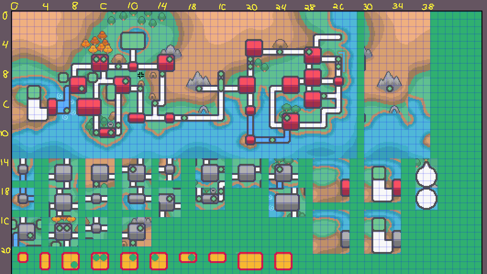

We can start to circle gray positions really nicely, but circling red positions seems to be weird (bear with me, the circles are red and gray respectively and are a little hard to see):


Entries 0x00 (Pallet), 0x01 (Viridian), and 0x05 (Vermilion) are circled on the map using the raw coordinates.

For whatever reason, the red position fields are offset by 1 each.  So on the image, the ``redX`` field actually references a position of ``redX - 1``.  The ``redY`` field then references a position of ``redY + 1``--``redX`` is one less than what it should be, and ``redY`` is one more than it should be.

The gray fields are not affected by this issue.  Circling the adjusted red ones, offset 1 left and 1 down:


That shows the top left of each city and the place that its replaced with.

We can tell how much to circle by the ``townDim`` field.  The ``townDim`` field is just a byte where the significant nybble is the y dimension and the other the x dimension.  For example, the ``townDim`` for Azalea is ``12``, showing a y dimension of 1 and an x dimension of 2.  The ``replDim`` byte is the dimension of the replacement (encoded similarly)--before you visit the place, it replaces the red on the town map with the gray below.  This byte is the dimensions of that area.  For example, the ``replDim`` byte for Goldenrod City is ``45``, meaning that the gray replacement area of Goldenrod is on a 5 horizontal by 4 vertical area.  Finally, the ``offsetPos`` byte describes the x- and y-offset away from the base coordinate the town itself actually starts, once again similarly encoded in the nybbles.

Dissecting a full entry:

Entry ``0x0D`` corresponds to a map header of ``49 00``--after converting from little endian--``0x49``.  This corresponds to a map header of Violet City.  The ``gateHeader`` also has the Violet City map header.
Its ``entry1``--which I believe is something of a "flight spot flag"--is ``0xD`` with an ``entry2``--which I believe is some sort of "city visited" flag--of ``0xC``.
The ``redX``, ``redY`` fields show it belonging here (after being adjusted with the 1 offsets), and the ``grayX``, ``grayY`` position is circled as well.  The areas are both circled to account for ``replDim``, with ``townDim`` being located inside of each at an offset of ``offsetPos``.

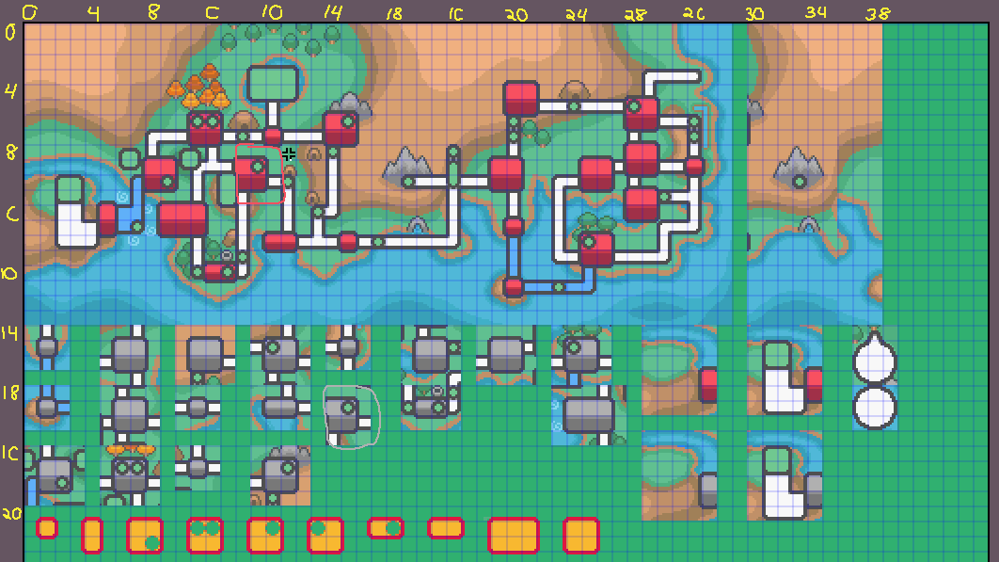

I would strongly recommend making something like an Excel sheet or a Google Sheets workbook to keep track of all of this!  It allows for quick adjustments such that you know what each field is in addition to being something you can always keep open to reference.  Mine looks like this:

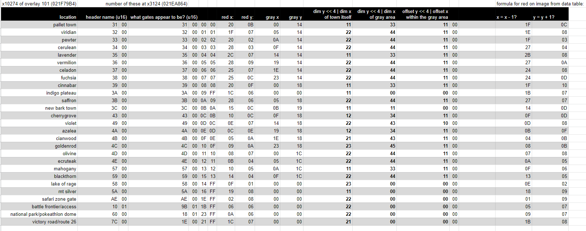

This can then just copy-paste the table into HxD or similar for easy updating and editing (especially on a ROM with entirely decompressed overlays).

My table looks like:
```
        mapHeader  gateHeader  entry1  entry2  redX  redY  grayX  grayY  townDim  replDim  offsetPos  padding
[0x00]  31 00      31 00       00      00      06    0C    00     14     11       33       11         00       // littleroot
[0x01]  32 00      32 00       01      01      06    0A    00     17     11       23       11         00       // oldale
[0x02]  33 00      33 00       02      02      02    05    03     14     22       44       11         00       // rustboro
[0x03]  34 00      34 00       03      03      11    0A    0A     17     11       33       11         00       // pacifidlog
[0x04]  35 00      35 00       04      04      04    0F    00     1C     11       33       11         00       // dewford
[0x05]  36 00      36 00       05      05      09    0A    03     18     22       44       11         00       // slateport
[0x06]  37 00      37 00       06      06      09    06    03     1C     12       34       11         00       // mauville
[0x07]  38 00      38 00       07      07      06    06    07     14     11       33       11         00       // verdanturf
[0x08]  39 00      39 00       08      08      07    03    07     17     11       33       11         00       // lavaridge
[0x09]  3A 00      3A 00       09      09      04    01    07     1A     11       33       11         00       // fallarbor
[0x0A]  3B 00      3B 00       0A      0A      0D    01    07     1D     11       33       11         00       // fortree
[0x0B]  3C 00      3C 00       0B      0B      11    03    0D     17     23       45       11         00       // lilycove
[0x0C]  43 00      43 00       0C      0C      17    04    0D     14     12       34       11         00       // mossdeep
[0x0D]  49 00      49 00       0D      0D      15    07    0A     14     11       33       11         00       // sootopolis
[0x0E]  4A 00      4A 00       0E      0E      1A    07    0A     1A     21       43       11         00       // ever grande
[0x0F]  4B 00      4B 00       0F      0F      03    0A    00     19     11       23       11         00       // petalburg (replaced cianwood)
[0x10]  4C 00      4C 00       10      10      0E    0E    0D     1B     11       33       11         00       // battle frontier
[0x11]  4D 00      4D 00       11      11      08    07    00     00     11       00       00         00       // battle frontier 2
[0x12]  4E 00      4E 00       12      12      0B    04    00     00     22       00       00         00       // empty
[0x13]  57 00      57 00       13      13      10    05    00     00     11       00       00         00       // empty
[0x14]  59 00      59 00       15      13      14    04    00     00     22       00       00         00       // empty
[0x15]  58 00      58 00       14      FF      0F    01    00     00     23       00       00         00       // empty
[0x16]  5A 00      5A 00       16      FF      19    08    00     00     11       00       00         00       // empty
[0x17]  AE 00      AE 00       1E      FF      02    08    00     00     22       00       00         00       // safari zone gate
[0x18]  10 01      9B 01       1B      FF      06    06    00     00     22       00       00         00       // battle frontier/access
[0x19]  60 00      18 01       23      FF      0A    06    00     00     22       00       00         00       // national park/athlon dome
[0x1A]  7C 00      1E 00       21      FF      1C    07    00     00     21       00       00         00       // victory road/route 26
```
Inserting into the ROM:

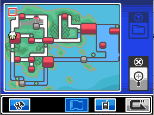

We can see that unregistered areas (Pacifidlog, Dewford, Lavaridge) are copied properly from their gray entries below.  All the red areas are also properly partitioned and are just fine when registered.

## Part 3 - Overlay 101 - Orange Selection Blocks

Next part:  The orange selection blocks.  Walking around the map will show that the old selection blocks are still there:

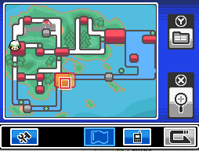

As previously mentioned, overlay 101 has another table.  This table is at 0xFC32 (0x021F7372) of overlay 101 and amount at 0x44 and 0x6156 (0x021E7784 and 0x021ED896) and has the format for each entry:
```c
struct GearMapTownSelectionOverlay
{
    /* 0x0 */ u16 mapHeader;
    /* 0x2 */ u8 baseX; // in poke gear position
    /* 0x3 */ u8 baseY; // in poke gear position
    /* 0x4 */ u8 dimY:4; // msn
              u8 dimX:4; // lsn
    /* 0x5 */ u8 flags;
    /* 0x6 */ u8 textEntry; // in a027 file 273
    /* 0x7 */ u8 flySpot;
    /* 0x8 */ u32 padding;
    /* 0xC */ u8 orangeBaseX; // in image
    /* 0xD */ u8 orangeBaseY; // in image
    /* 0xE */ u8 orangeDimX; // in image
    /* 0xF */ u8 orangeDimY; // in image
}; // size = 0x10
```
Note that I have yet to document what the flags do.

The table split up by entry:
```
09 02 13 02 33 C0 41 00 00 00 00 00 00 00 00 00
33 01 18 10 33 C0 45 00 00 00 00 00 00 00 00 00
78 00 15 06 11 00 37 00 00 00 00 00 05 28 01 01
7B 00 11 0A 11 00 3A 00 00 00 00 00 0A 28 01 01
7B 00 13 0C 11 00 3A 00 00 00 00 00 0C 2C 01 01
7B 00 14 08 11 00 3A 00 00 00 00 00 0D 28 01 01
6E 00 0F 09 11 00 27 00 00 00 00 00 05 28 01 01
63 00 0E 0F 11 00 2E 00 00 00 00 00 08 2C 01 01
72 00 0D 10 11 00 2F 00 00 00 00 00 05 28 01 01
75 00 0B 10 11 00 34 00 00 00 00 00 05 2D 01 01
60 00 0A 08 22 44 2B 00 00 00 00 00 00 25 02 02
6F 00 0C 06 11 00 28 00 00 00 00 00 05 28 01 01
07 00 0B 06 11 00 2A 00 00 00 00 00 05 28 01 01
77 00 0E 07 11 00 36 00 00 00 00 00 05 28 01 01
79 00 07 0D 11 00 38 00 00 00 00 00 01 2E 01 01
...
```
<details>
<summary>Further elaborating on the table (click for drop down!)</summary>

This table is (somewhat) sporadically labeled, instead of being super in-depth.
```
        mapHeader  baseX  baseY  dim  flags  textEntry  flySpot  padding      orangeBaseX  orangeBaseY  orangeDimX  orangeDimY
[0x00]  09 02      13     02     33   C0     41         00       00 00 00 00  00           00           00          00          // sinjoh ruins
[0x01]  33 01      18     10     33   C0     45         00       00 00 00 00  00           00           00          00          // s.s. aqua
[0x02]  78 00      15     06     11   00     37         00       00 00 00 00  05           28           01          01          // ice path
[0x03]  7B 00      11     0A     11   00     3A         00       00 00 00 00  0A           28           01          01          // dark cave 1
[0x04]  7B 00      13     0C     11   00     3A         00       00 00 00 00  0C           2C           01          01          // dark cave 2
[0x05]  7B 00      14     08     11   00     3A         00       00 00 00 00  0D           28           01          01          // dark cave 3
[0x06]  6E 00      0F     09     11   00     27         00       00 00 00 00  05           28           01          01
[0x07]  63 00      0E     0F     11   00     2E         00       00 00 00 00  08           2C           01          01
[0x08]  72 00      0D     10     11   00     2F         00       00 00 00 00  05           28           01          01
[0x09]  75 00      0B     10     11   00     34         00       00 00 00 00  05           2D           01          01
[0x0A]  60 00      0A     08     22   44     2B         00       00 00 00 00  00           25           02          02          // national park
[0x0B]  6F 00      0C     06     11   00     28         00       00 00 00 00  05           28           01          01
[0x0C]  07 00      0B     06     11   00     2A         00       00 00 00 00  05           28           01          01
[0x0D]  77 00      0E     07     11   00     36         00       00 00 00 00  05           28           01          01
[0x0E]  79 00      07     0D     11   00     38         00       00 00 00 00  01           2E           01          01
[0x0F]  7E 00      17     0E     11   00     3D         00       00 00 00 00  06           28           01          01
[0x10]  7C 00      1C     09     21   40     3B         00       00 00 00 00  03           25           01          02
[0x11]  93 00      20     07     11   00     3E         00       00 00 00 00  0F           29           01          01
[0x12]  6A 00      20     06     11   00     21         00       00 00 00 00  0F           28           01          01
[0x13]  6A 00      2A     0B     11   00     21         00       00 00 00 00  1C           2B           01          01
[0x14]  6B 00      24     05     11   00     22         00       00 00 00 00  06           28           01          01
[0x15]  91 00      28     05     11   00     23         00       00 00 00 00  05           28           01          01
[0x16]  6C 00      2C     06     11   00     24         00       00 00 00 00  1F           29           01          01
[0x17]  E9 01      2C     07     11   00     43         00       00 00 00 00  1F           2A           01          01
[0x18]  92 00      23     11     11   00     26         00       00 00 00 00  06           28           01          01
[0x19]  10 01      06     08     22   44     32         00       00 00 00 00  00           25           02          02
[0x1A]  DF 01      25     0E     11   00     25         00       00 00 00 00  05           28           01          01
[0x1B]  DC 00      09     0A     11   00     30         00       00 00 00 00  05           28           01          01
[0x1C]  31 00      20     0D     11   00     0A         01       00 00 00 00  00           20           03          03          // pallet town
[0x1D]  32 00      1F     09     22   44     0B         02       00 00 00 00  23           20           04          04          // viridian town
[0x1E]  33 00      20     04     22   44     0C         03       00 00 00 00  23           20           04          04          // pewter
[0x1F]  34 00      28     05     22   84     0D         04       00 00 00 00  12           20           04          04          // cerulean
[0x20]  35 00      2C     09     11   00     0E         05       00 00 00 00  00           20           03          03          // lavender
[0x21]  36 00      28     0B     22   44     0F         06       00 00 00 00  23           20           04          04          // vermilion
[0x22]  37 00      25     09     22   44     10         07       00 00 00 00  23           20           04          04          // celadon
[0x23]  38 00      25     0E     22   84     11         08       00 00 00 00  12           20           04          04          // fuchsia
[0x24]  39 00      20     11     11   00     12         09       00 00 00 00  00           20           03          03          // cinnabar
[0x25]  3B 00      28     08     22   44     14         0A       00 00 00 00  23           20           04          04          // saffron
[0x26]  3C 00      15     0E     11   00     15         0B       00 00 00 00  00           20           03          03          // new bark town
[0x27]  43 00      10     0E     12   04     16         0C       00 00 00 00  1A           20           04          03          // cherrygrove
[0x28]  49 00      0E     09     22   84     17         0D       00 00 00 00  0E           20           04          04          // violet
[0x29]  4A 00      0C     10     11   00     18         0E       00 00 00 00  16           20           04          03          // azalea
[0x2A]  4B 00      05     0C     21   40     19         0F       00 00 00 00  03           20           03          04          // cianwood
[0x2B]  4C 00      09     0C     23   48     1A         10       00 00 00 00  1E           20           05          04          // goldenrod
[0x2C]  4D 00      08     09     22   04     1B         11       00 00 00 00  06           20           04          04          // olivine
[0x2D]  4E 00      0B     06     22   84     1C         12       00 00 00 00  0A           20           04          04          // ecruteak
[0x2E]  57 00      10     07     11   00     1D         13       00 00 00 00  00           20           03          03          // mahogany
[0x2F]  59 00      14     06     22   84     1F         14       00 00 00 00  0E           20           04          04          // blackthorn
[0x30]  3A 00      1C     08     11   00     13         00       00 00 00 00  05           28           01          01          // indigo plateau
[0x31]  58 00      0F     03     23   48     1E         00       00 00 00 00  1E           20           05          04
[0x32]  5A 00      19     0A     11   00     39         00       00 00 00 00  05           28           01          01
[0x33]  08 00      0D     0A     21   40     2D         00       00 00 00 00  03           20           03          04
[0x34]  AE 00      02     0A     22   44     44         00       00 00 00 00  09           25           02          02
[0x35]  09 00      20     0B     21   40     46         00       00 00 00 00  0F           2E           01          02
[0x36]  0A 00      20     08     11   00     47         00       00 00 00 00  0F           2A           01          01
[0x37]  0B 00      22     05     12   04     48         00       00 00 00 00  19           28           02          01
[0x38]  0C 00      25     05     13   04     49         00       00 00 00 00  1C           28           03          01
[0x39]  0D 00      28     07     11   00     4A         00       00 00 00 00  19           2C           01          01
[0x3A]  0E 00      28     0A     11   00     4B         00       00 00 00 00  1A           2C           01          01
[0x3B]  0F 00      27     09     11   00     4C         00       00 00 00 00  18           2C           01          01
[0x3C]  10 00      2A     09     12   04     4D         00       00 00 00 00  1B           2C           02          01
[0x3D]  11 00      2A     06     12   04     4E         00       00 00 00 00  1D           29           02          01
[0x3E]  12 00      2C     08     11   00     4F         00       00 00 00 00  1F           2B           01          01
[0x3F]  13 00      2B     0B     11   00     50         00       00 00 00 00  1D           2B           01          01
[0x40]  14 00      2C     0A     31   40     51         00       00 00 00 00  1E           2A           01          03
[0x41]  15 00      2A     0D     13   04     52         00       00 00 00 00  1C           2D           03          01
[0x42]  16 00      2A     0E     21   40     53         00       00 00 00 00  1C           2E           01          02
[0x43]  17 00      27     0F     13   0C     54         00       00 00 00 00  19           2F           03          01
[0x44]  18 00      23     0A     12   04     55         00       00 00 00 00  17           28           02          01
[0x45]  19 00      23     0B     41   C0     56         00       00 00 00 00  17           29           01          04          // 
[0x46]  1A 00      23     0F     12   04     57         00       00 00 00 00  17           2D           02          01
[0x47]  5B 00      25     10     21   40     58         00       00 00 00 00  16           2D           01          02
[0x48]  5C 00      21     11     14   08     59         00       00 00 00 00  12           2E           04          01
[0x49]  5D 00      20     0E     31   C0     5A         00       00 00 00 00  11           2D           01          03          // 
[0x4A]  1B 00      1D     0A     12   04     5B         00       00 00 00 00  15           28           02          01
[0x4B]  1C 00      29     04     11   00     5D         00       00 00 00 00  18           2A           01          01
[0x4C]  1D 00      29     03     14   0C     5E         00       00 00 00 00  18           29           04          01
[0x4D]  1E 00      1C     0B     41   C0     5F         00       00 00 00 00  14           29           01          04          // 
[0x4E]  1F 00      16     0E     16   0F     60         00       00 00 00 00  0E           2C           06          01
[0x4F]  20 00      1A     0A     12   04     61         00       00 00 00 00  12           28           02          01
[0x50]  21 00      12     0E     13   0C     62         00       00 00 00 00  0B           2E           03          01
[0x51]  22 00      11     0B     31   40     63         00       00 00 00 00  0A           29           01          03
[0x52]  23 00      10     0A     12   01     64         00       00 00 00 00  09           28           01          01
[0x53]  24 00      0E     0B     41   C0     65         00       00 00 00 00  08           28           01          04
[0x54]  25 00      0E     10     11   00     66         00       00 00 00 00  08           2D           01          01
[0x55]  26 00      0B     0E     31   40     67         00       00 00 00 00  05           2B           01          02
[0x56]  27 00      0B     0A     21   40     68         00       00 00 00 00  02           2D           01          02
[0x57]  28 00      0B     09     13   04     69         00       00 00 00 00  02           2C           03          01
[0x58]  29 00      0C     08     11   00     6A         00       00 00 00 00  03           2B           01          01
[0x59]  2A 00      09     07     12   04     6B         00       00 00 00 00  01           28           02          01
[0x5A]  2B 00      08     07     21   40     6C         00       00 00 00 00  00           28           01          02
[0x5B]  5E 00      07     0A     21   40     6D         00       00 00 00 00  01           2A           01          02
[0x5C]  5F 00      06     0C     22   04     6E         00       00 00 00 00  00           2C           02          02
[0x5D]  2C 00      0D     07     13   02     6F         00       00 00 00 00  02           2A           03          01
[0x5E]  2D 00      10     05     21   40     70         00       00 00 00 00  03           28           01          02
[0x5F]  2E 00      11     07     13   08     71         00       00 00 00 00  05           2A           03          01
[0x60]  2F 00      14     09     41   80     72         00       00 00 00 00  0D           29           01          04
[0x61]  30 00      13     0D     21   00     73         00       00 00 00 00  0C           2D           01          01
[0x62]  97 00      02     0D     23   48     74         00       00 00 00 00  20           29           03          02
[0x63]  98 00      02     0C     12   04     75         00       00 00 00 00  20           28           02          01
```
</details>

These are all as simple as the table makes it seem.  When anywhere within the coordinates ``(baseX+dimX, baseY+dimY)``, the PokéGear will select the entire orange area as specified on the image by the area ``(orangeBaseX+orangeDimX, orangeBaseY+orangeDimY)``.

This can also similarly be broken down into a nice spreadsheet for easy editing and pasting into the ROM.  I actually include mine as a [template for you to download](town_map_blocks.xlsx).  My entries look something like this (each commented):
```
        mapHeader  baseX  baseY  dim  flags  textEntry  flySpot  padding      orangeBaseX  orangeBaseY  orangeDimX  orangeDimY
[0x00]  31 00      06     0E     11   00     0A         01       00 00 00 00  00           20           03          03          // littleroot
[0x01]  32 00      06     0C     11   00     0B         02       00 00 00 00  00           20           03          03          // oldale
[0x02]  33 00      02     07     22   00     0C         03       00 00 00 00  23           20           04          04          // rustboro
[0x03]  34 00      11     0C     11   00     0D         04       00 00 00 00  00           20           03          03          // pacifidlog
[0x04]  35 00      04     11     11   00     0E         05       00 00 00 00  00           20           03          03          // dewford
[0x05]  36 00      09     0C     22   00     0F         06       00 00 00 00  23           20           04          04          // slateport
[0x06]  37 00      09     08     12   00     10         07       00 00 00 00  1A           20           04          03          // mauville
[0x07]  38 00      06     08     11   00     11         08       00 00 00 00  00           20           03          03          // verdanturf
[0x08]  39 00      07     05     11   00     12         09       00 00 00 00  00           20           03          03          // lavaridge
[0x09]  3B 00      0D     03     11   00     14         0A       00 00 00 00  00           20           03          03          // fortree
[0x0A]  3C 00      11     05     23   00     15         0B       00 00 00 00  1E           20           05          04          // lilycove
[0x0B]  43 00      17     06     12   00     16         0C       00 00 00 00  1A           20           04          03          // mossdeep
[0x0C]  49 00      15     09     11   00     17         0D       00 00 00 00  00           20           03          03          // sootopolis
[0x0D]  4A 00      1A     09     21   00     18         0E       00 00 00 00  0C           24           03          04          // ever grande
[0x0E]  4B 00      03     0C     11   00     19         0F       00 00 00 00  00           20           03          03          // petalburg
[0x0F]  3A 00      04     03     11   00     13         10       00 00 00 00  00           20           03          03          // fallarbor
[0x10]  4C 00      0E     10     11   00     1A         11       00 00 00 00  00           20           03          03          // battle frontier
```
Note that I haven't done the routes yet, but the cities are there to demonstrate functionality.  As an example, my Rustboro city is at ``(2, 7)`` on the map, has a selectable dimension of 2x2, uses text entry as a blurb ``0x0C`` from a027/273 on the top screen when selected, and uses fly spot 2.
Furthermore, the orange block that shows it is highlighted is located at ``(0x23, 0x20)`` on the massive town map image from earlier and is 4x4 in size.

Putting everything together, we can run through the map rather nicely:

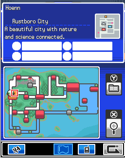  

## TODO
- ``flags`` field in ``GearMapTownSelectionOverlay``
- PokéDex Map Editing
- Roamer Maps Possible
- Make sure flight spots work
