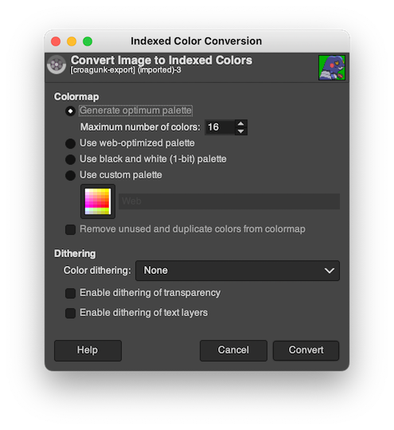
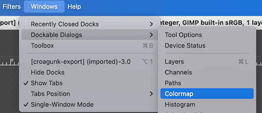
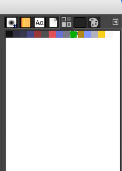
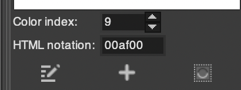
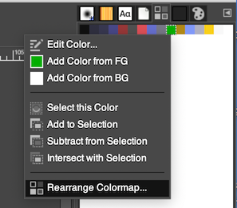
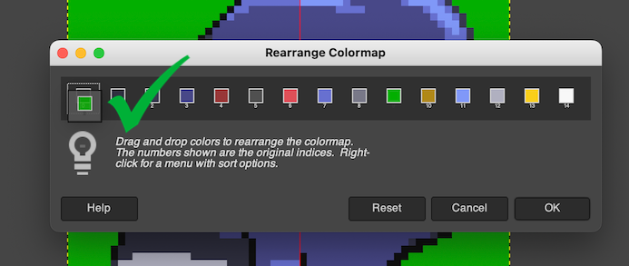
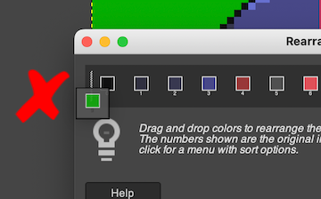
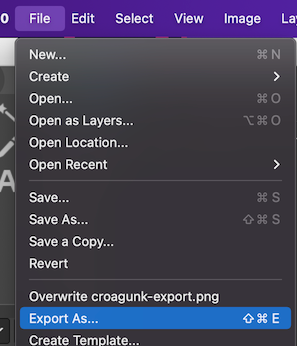

# Sprite Indexing with GIMP Guide

This guide aims to serve as general instructions for indexing a sprite using GIMP, a free and open-source image editing program which is available on GNU/Linux, macOS, Windows, and more

---

## Instructions

1. **To begin, if you don't have it already, you'll want to download [GIMP](https://www.gimp.org/downloads/).**
2. From here, open an image of your choice in GIMP. If this image has an alpha channel, it technically can be removed, but that image most likely wouldn't be ideal for inserting in the first place and really shouldn't be used.
3. Depending on the constraints of what kind of image you are replacing, the number of colors available for your indexed image may vary. In most cases, you are either limited to 256 colors or 16 colors. This guide will assume you are indexing an image that can only have 16 colors, but the same process will work for a 256 color image.

**NOTE:** if your image is already indexed adequately, such as if you are editing an existing image exported from the ROM, you may skip ahead to "Editing an Indexed Image".

### Indexing

4. In the toolbar, you'll want to go to `Image -> Mode -> Indexed...`
5. If `Generate optimum palette` isn't already selected, do so. After that, set the maximum number of colors to 16. Press `Convert` in the bottom right of the window.

    

### Editing an Indexed Image

6. To make it so you can edit the palette order and/or see/edit the colors in the palette, go to `Windows -> Dockable Dialogues -> Colormap`.

    

   Doing so will bring up the following tab:

    

7. From here, you can double-click on the colors in the palette to edit them. Located at the bottom of the Colormap tab is this bar:

    

   You can also press the button that has a pencil and some lines in order to edit the currently selected color. The plus-sign button can be used to add a new color to the palette.

### Putting the Background Color in Index 0

8. You can right-click on a color to get this menu, then from there, you press `Rearrange Colormap...`. Click and drag the color you want to move to index 0 of the palette.

   
   

    When you go to let go of the dragged color, **MAKE SURE** there is a white box surrounding the color at index 0, as shown in the first image below. It **SHOULD NOT** look like the second image below, with a white line to either side, on-top of, or below the color. From here, just press `Ok`.

    
    

### Saving

10. Go to `File -> Export As...`

    

11. Choose where you want to output the file, and make sure you use the `.png` extension.

12. Make sure you select `8bpc RGB` for the output format.

    
13. Now, you can insert the exported image into the game files, as per the instructions of any other guide you may be following or tool you may be using.