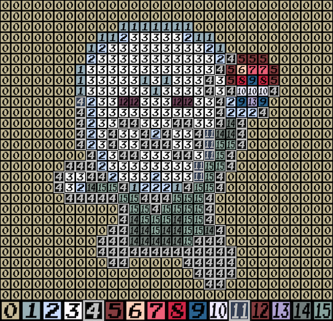

# Intro to Sprite Indexing
> This document was written by turtleisaac

This document aims to introduce the concept of indexing a sprite

---

## Indexing
Indexing is a process that converts an image from having a specific color assigned to each individual pixel to having a centralized palette where the RGB(A) values are stored.

By doing this, each pixel is assigned a specific index within the palette instead of an individual color. This allows image files to take up less space.

## Special Considerations for the Nintendo DS
* The Pokémon DS games (and most others) use NCGR files for storing images, and NCLR files for storing palettes. The NCLR file that a NCGR pulls its palette information from is determined by the code of the game, so when viewing or replacing NCGR files in a tool like Tinke, you must first select the proper NCLR for that image for the correct palette to be displayed
* Sprites within these games lack an alpha channel
  * If the game is programmed to display the image with any form of transparency, it will use the color at index 0 of the palette to determine what part of the sprite should be made transparent when displaying it
* Most sprites are 8bpp (8 bits per pixel), meaning they have a maximum palette size of 256 colors

[//]: # (## Formatting Requirements for Specific Sprites)

[//]: # (> Dimensions are in Width x Height format)

[//]: # (* Pokémon Battle Sprites - 16 colors, index 0 is background color - )

---

## Guides for Specific Tools
* [GIMP](gimp/gimp.md)

> TODO: Aseprite, Photoshop, GraphicsGale, Paint.NET